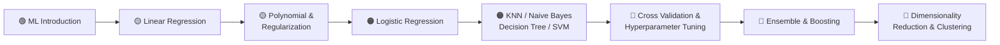

---

## | About Me |

**Data Analyst | Machine Learning Enthusiast | Telugu Content Creator** 📊

Nenu **Raviteja Buddha** — Machine Learning ni Telugu lo simple ga explain chestu,
notes ni "Explain Like I'm 10" style lo prepare chestunna.
Telugu medium students ki ML easy ga ardham avvali — idi naa goal! 🎯

---

## 📖 Introduction 

Ee repository lo Machine Learning **complete notes** unnayi — anni PDF format lo.
Prati topic ni **"Explain Like I'm 10"** style lo, Telugu words English letters lo
(transliteration) rasanu. Technical terms anni English lo untayi, so interviews
ki kuda easy ga prepare avvacchu! 💪

> 💡 **Note:** Anni PDFs ee repo lo unnayi — click chesi download cheyandi!

---

## 🗺️ Learning Roadmap

---

## 🚀 Topics List 

### 📌 Part 1: Basics & Regression

| # | Topic | Ela undi ante emiti? | Notes |
|---|-------|---------------------|-------|
| 1 | Machine Learning Introduction | Computer ki data istam, adi patterns nerchukuntundi | 📄 [View in Repo](https://github.com/Kushi153/Telugu-ML-Vibe) |
| 2 | Linear Regression | Output variable continuous ga unte — line draw chesi predict cheyadam | 📄 [View in Repo](https://github.com/Kushi153/Telugu-ML-Vibe) |
| 3 | Multicollinearity | Input variables madhya ekkuva correlation unte emavtundo notes | 📄 [View in Repo](https://github.com/Kushi153/Telugu-ML-Vibe) |
| 4 | Polynomial & Regularization | Data curve shape lo unte polynomial; overfitting control ki regularization | 📄 [View in Repo](https://github.com/Kushi153/Telugu-ML-Vibe) |
| 5 | Polynomial Regression Calculation | Step-by-step calculations examples tho | 📄 [View in Repo](https://github.com/Kushi153/Telugu-ML-Vibe) |
| 6 | Regression Metrics | MAE, MSE, RMSE, R² score — model baga perform chestundo ela check cheyali | 📄 [View in Repo](https://github.com/Kushi153/Telugu-ML-Vibe) |

### 📌 Part 2: Classification

| # | Topic | Ela undi ante emiti? | Notes |
|---|-------|---------------------|-------|
| 7 | Logistic Regression | Output yes/no type (binary) lo unte vaadatam — probability istundi | 📄 [View in Repo](https://github.com/Kushi153/Telugu-ML-Vibe) |
| 8 | Classification Challenges | Classification lo vastunne common problems | 📄 [View in Repo](https://github.com/Kushi153/Telugu-ML-Vibe) |
| 9 | Imbalanced Data Complete Guide | Oka class data ekkuva, inkoti takkuva unte em cheyali — full guide | 📄 [View in Repo](https://github.com/Kushi153/Telugu-ML-Vibe) |
| 10 | KNN Notes | "Neighbours chusi cheppu" — daggarlo unna points base chesi classify cheyadam | 📄 [View in Repo](https://github.com/Kushi153/Telugu-ML-Vibe) |
| 11 | Naive Bayes Algorithm | Probability (Bayes theorem) base chesi fast ga classify cheyadam | 📄 [View in Repo](https://github.com/Kushi153/Telugu-ML-Vibe) |
| 12 | Decision Tree Notes | Questions adugutuu tree laaga split chesi decision teesukovadam 🌳 | 📄 [View in Repo](https://github.com/Kushi153/Telugu-ML-Vibe) |
| 13 | SVM Complete Notes | Data ni best margin tho separate cheyadam — complete notes | 📄 [View in Repo](https://github.com/Kushi153/Telugu-ML-Vibe) |

### 📌 Part 3: Model Improvement

| # | Topic | Ela undi ante emiti? | Notes |
|---|-------|---------------------|-------|
| 14 | Cross Validation | Data ni multiple parts lo divide chesi model ni test cheyadam | 📄 [View in Repo](https://github.com/Kushi153/Telugu-ML-Vibe) |
| 15 | Hyperparameter Tuning | Model settings ni best ga set cheyadam — GridSearch, RandomSearch | 📄 [View in Repo](https://github.com/Kushi153/Telugu-ML-Vibe) |
| 16 | Ensemble Learning | Ekkuva models kalipi oka strong model cheyadam — "team work" 💪 | 📄 [View in Repo](https://github.com/Kushi153/Telugu-ML-Vibe) |
| 17 | Boosting All Models | AdaBoost, Gradient Boosting, XGBoost, CatBoost — anni models notes | 📄 [View in Repo](https://github.com/Kushi153/Telugu-ML-Vibe) |

### 📌 Part 4: Unsupervised Learning

| # | Topic | Ela undi ante emiti? | Notes |
|---|-------|---------------------|-------|
| 18 | Dimensionality Reduction | Features ekkuva unte important vatini matrame unchadam — PCA lanti techniques | 📄 [View in Repo](https://github.com/Kushi153/Telugu-ML-Vibe) |
| 19 | Clustering Models | Labels lekunda, similar data ni groups lo divide cheyadam — KMeans etc. | 📄 [View in Repo](https://github.com/Kushi153/Telugu-ML-Vibe) |

---

## 🧠 Machine Learning ante emiti? (What is ML?)

- **Traditional Programming lo:** Manam rules manually write chestam
- **Machine Learning lo:** Manam data and known answers istam; computer aa data
  nundi useful patterns ni **automatic ga learn chestundi** 🤖

**Simple example:** 🍎 Pillalaki apple photo chupisthe apple gurinchi nerputham.
Alaage computer ki 1000 apple images chupisthe, kotha image chusi
"idi apple" ani cheppagaligithe — adi Machine Learning!

---

## ✨ Ee Notes Enduku Special?

- ✅ **Telugu Transliteration lo** — Telugu medium students ki easy ga ardhamavtundi
- ✅ **"Explain Like I'm 10"** style — complex topics simple words lo
- ✅ **Technical terms English lo** — interviews, placements ki direct ga use cheyavvacchu
- ✅ **PDF format** — Mobile lo kuda easy ga read cheyaccu 📱
- ✅ **Basics nunchi Advanced** varaku step-by-step
- ✅ **100% Free** — evaraina vaadukovacchu 🎉

---

## 📊 GitHub Stats

---

## 🔮 Future Plans

- 🔜 Deep Learning notes (Neural Networks)
- 🔜 NLP (Natural Language Processing) notes
- 🔜 Practical projects with code
- 🔜 Interview questions PDF

---

## 🤝 Contributing

Meeru kuda topics improve cheyali anukunte:

1. 🍴 Ee repo ni **Fork** cheyandi
2. 🌿 Kotha **Branch** create cheyandi
3. ✏️ Changes cheyandi
4. 📤 **Pull Request** pampandi

---

## 📬 Connect With Me | 

| Platform | Link |
|----------|------|
| 💼 **LinkedIn** | [raviteja-buddha-data-analyst](https://www.linkedin.com/in/raviteja-buddha-data-analyst) |
| 🏆 **Kaggle** | [kushi00](https://www.kaggle.com/kushi00) |
| 💬 **WhatsApp** | [+91 97035 04923](https://wa.me/919703504923) |
| 🐙 **GitHub** | [Kushi153](https://github.com/Kushi153) |

<a href="https://www.linkedin.com/in/raviteja-buddha-data-analyst">
  
⭐ Ee notes meeku useful ga unte Star cheyandi!
Thank You Animation
🙏 Thank You
"Nerchuko (Learn) • Implement cheyyi (Build) • Share cheyyi (Give Back)" 🔄

  Typing Animation
© 2025 Raviteja Buddha | Made with ❤️ for Telugu Students
---
